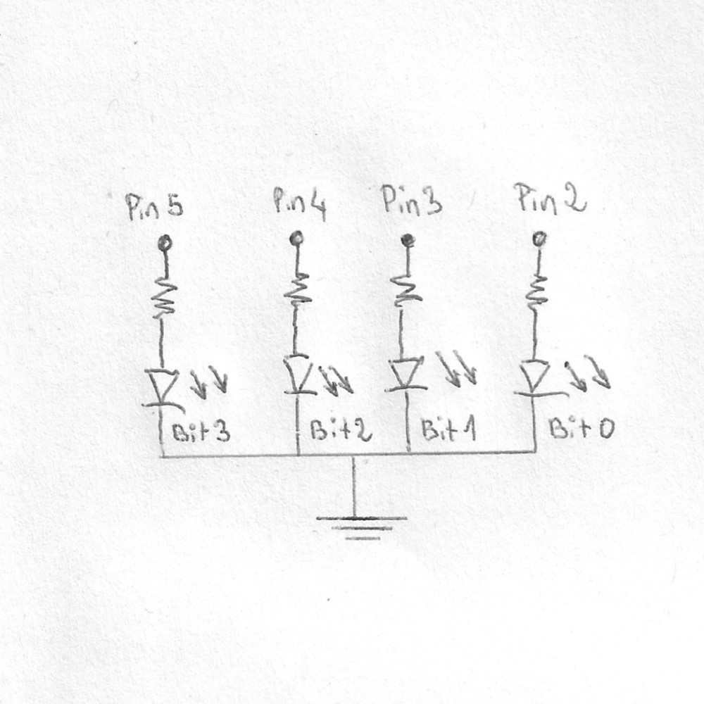

# 4-bits-counter
4 bits counter using a arduino uno R3 microcontroller

## components used:
* x 1 - arduino uno R3 microcontroller
* x 4 - 330 ohms resistors
* x 4 - red leds
* x 1 - breadboard

## circuit schematic

